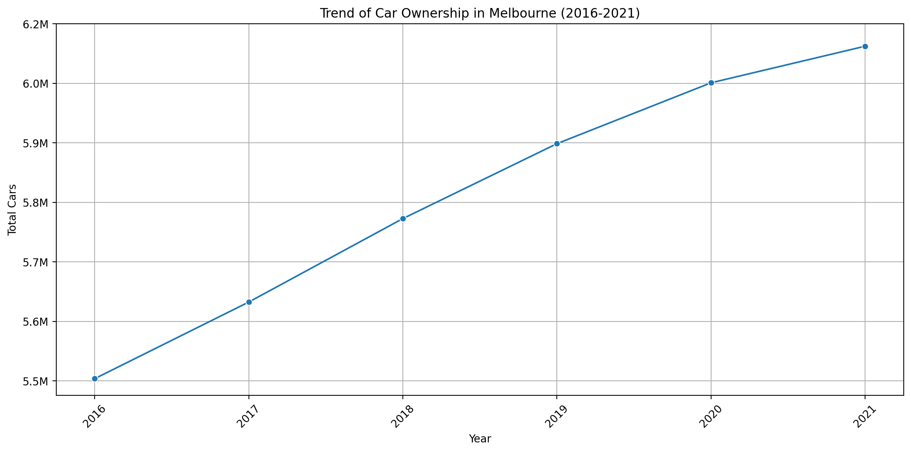

## ABS Annual Car Ownership DB Backend API

### How DataBase Constructed?
📓 [Detail Process](./car_ownership.ipynb)

### Data Source
📁 Motor Vehicle Census, 2016-2021 [ABS Raw Datasets](./ABS%20RAW%20Datasets)

💾 Reference: Australian Bureau of Statistics. (2016-2021). *Motor Vehicle Census, Australia, 2021*[TableBuilder]. Australian Government. https://www.abs.gov.au/statistics/microdata-tablebuilder/tablebuilder

### API Endpoints
- GET /ownership: Call Total Data (JSON)
- GET /ownership/{state} : Call specific State data (e.g.,VIC, NSW)
  
  - For this project, Melbourne is VIC (Victoria).

- GET /ownership/{state}{year} : Call data per state/year

### API Swagger UI
🔗 https://carownershipbackendapi-production.up.railway.app/docs

### Mockup of Growth of Car Ownership in Line graph

