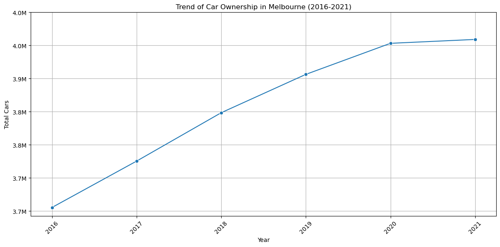

# 🚗 Melbourne Mobility Insights Project

> **Melbourne Mobility Insights**: A comprehensive platform analyzing Melbourne's car ownership and population trends using ABS datasets (2016–2021)

## 📋 Project Overview

Melbourne Mobility Insights is a full-stack web application that analyzes and visualizes mobility trends in Melbourne using Australian Bureau of Statistics (ABS) motor vehicle registration and population data.

### 🎯 Key Objectives
- Analyze car ownership trends in Melbourne (Victoria) from 2016-2021
- Examine population changes across Melbourne CBD regions and their correlation with mobility patterns
- Provide data-driven insights for urban transportation policy development

## 🏗️ Project Architecture

```
Melbourne Mobility Insights
├── 🎨 Frontend (Static Web App)
│   ├── HTML/CSS/JavaScript (Vanilla JS)
│   ├── Data visualization with Chart.js
│   └── Express.js static file server
│
├── 🔧 Backend API (FastAPI)
│   ├── RESTful API endpoints
│   ├── ABS data processing and delivery
│   └── CORS configuration for frontend integration
│
└── 📊 Data Processing (Jupyter Notebooks)
    ├── Raw ABS Excel data cleaning
    ├── Car ownership data preprocessing
    └── Population data transformation
```

## 🛠️ Technology Stack

### Backend
- **FastAPI**: Python web framework
- **Pandas**: Data processing and analysis
- **Uvicorn**: ASGI server
- **Railway**: Deployment platform

### Frontend
- **Vanilla JavaScript**: Frontend logic
- **Chart.js**: Data visualization
- **Tailwind CSS**: Styling framework
- **Express.js**: Static file server
- **Netlify**: Frontend deployment

### Data Processing
- **Jupyter Notebook**: Data analysis and preprocessing
- **Python**: Data processing language
- **Pandas**: Data manipulation

## 📁 Project Structure

```
mel-mobility-insights-project/
├── 📂 ABS Raw Datasets/          # Original ABS data files
│   ├── car2016-2021.xlsx        # Annual vehicle registration data
│   ├── passengercar2016-2021.xlsx # Passenger car data
│   └── ABS_Population_Estimates.xlsx # Population estimates
│
├── 📂 frontend/                  # Frontend web application
│   ├── index.html               # Main landing page
│   ├── services.html            # Car ownership analysis page
│   ├── population.html          # Population analysis page
│   ├── carownership.js          # Car data processing logic
│   ├── population.js            # Population data processing logic
│   └── server.js                # Express static server
│
├── 📊 car_ownership.ipynb       # Car data preprocessing notebook
├── 📊 population.ipynb          # Population data preprocessing notebook
├── 🐍 main.py                   # FastAPI backend server
├── 📄 paasengercar_ownership_cleaned.csv # Cleaned car data
├── 📄 population.csv            # Cleaned population data
└── 📄 requirements.txt          # Python dependencies
```

## 🚀 Deployment & Usage

### 🌐 Live Demo
- **Frontend**: [Melbourne Mobility Insights](https://mel-mobility-insights-production.up.railway.app/)
- **API Documentation**: [Swagger UI](https://carownershipbackendapi-production.up.railway.app/docs)

### Local Development

#### Backend API Setup
```bash
# Create and activate virtual environment
python -m venv venv
source venv/bin/activate  # Windows: venv\Scripts\activate

# Install dependencies
pip install -r requirements.txt

# Run FastAPI server
uvicorn main:app --reload --host 0.0.0.0 --port 8000
```

#### Frontend Setup
```bash
cd frontend

# Install dependencies
npm install

# Start development server
npm start
```

## 📊 API Endpoints

### Car Ownership Data
- `GET /ownership` - Retrieve all car ownership data
- `GET /ownership/{state}` - Get data by state (e.g., VIC for Victoria)
- `GET /ownership/{state}/{year}` - Get data by state and year

### Population Data
- `GET /population` - Retrieve all population data (individual regions)
- `GET /population/{area}` - Get data by area (east, west, north, total)
- `GET /population/{area}/{year}` - Get data by area and year

### Utility Endpoints
- `GET /` - API information and status
- `GET /health` - Service health check

## 📈 Data Sources

**Australian Bureau of Statistics (ABS)**
- **Motor Vehicle Census, 2016-2021**: Vehicle registration datasets
- **Population Estimates**: Melbourne CBD regional population data

> 💾 **Reference**: Australian Bureau of Statistics. (2016-2021). *Motor Vehicle Census, Australia, 2021* [TableBuilder]. Australian Government. https://www.abs.gov.au/statistics/microdata-tablebuilder/tablebuilder

## 📊 Key Analysis Results

### Car Ownership Trends


- Melbourne (Victoria) car ownership trends from 2016-2021
- Analysis of COVID-19 pandemic impact on vehicle ownership patterns

### Population Changes and Mobility Correlation
- Population changes across Melbourne CBD East/West/North regions
- Relationship analysis between regional car ownership rates and population density

## 🔄 Data Processing Pipeline

1. **Raw Data Collection**: Download Excel files via ABS TableBuilder
2. **Data Cleaning**: Preprocessing using Jupyter Notebooks
   - [`car_ownership.ipynb`](./car_ownership.ipynb): Car data cleaning
   - [`population.ipynb`](./population.ipynb): Population data cleaning
3. **CSV Conversion**: Transform data into API-ready format
4. **API Service**: Serve data through FastAPI RESTful endpoints

## 🤝 Contributing

1. Fork this repository
2. Create a feature branch (`git checkout -b feature/amazing-feature`)
3. Commit your changes (`git commit -m 'Add amazing feature'`)
4. Push to the branch (`git push origin feature/amazing-feature`)
5. Open a Pull Request

## 📝 License

This project is developed for educational purposes. ABS data follows the respective agency's licensing terms.

## 👥 Development Team

**FIT5120 Project Team**
- Data collection and preprocessing
- Backend API development
- Frontend web application development
- Deployment and operations

---

### 🔗 Related Links
- [ABS Motor Vehicle Census](https://www.abs.gov.au/statistics/transport/registrations/motor-vehicle-census-australia)
- [FastAPI Documentation](https://fastapi.tiangolo.com/)
- [Chart.js Documentation](https://www.chartjs.org/docs/latest/)